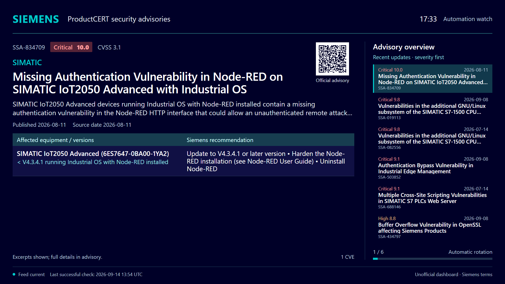

# Siemens Board

A Siemens ProductCERT security-advisory dashboard for PLC programmers and automation teams. Designed for an unattended Anthias screen at **`/tv`**, in English, at 1920×1080 landscape.

The backend follows the companion Beckhoff board: TypeScript, Node 26, SQLite in a bind-mounted `./data` directory, a cached read model, server-rendered HTML, small unbundled browser JavaScript, Docker Compose, and an optional Cloudflared tunnel. The Beckhoff project is unchanged.



The screenshot contains Siemens advisory excerpts under the source terms below.

## Run from source with Docker

```powershell
Copy-Item .env.example .env
New-Item -ItemType Directory -Force data
# Edit .env, including USER_AGENT with your contact address.
docker compose up -d --build
```

Open **http://localhost:8081/tv**. The board serves immediately and fills in advisory details in the background. Initial history enrichment takes time; selected recent automation advisories are processed first.

The published port binds to **localhost only** by default (`BOARD_BIND_IP=127.0.0.1`). Cloudflared still reaches `http://board:8080` over the Compose network; it does not need a LAN-published port. For deliberate direct LAN access, set `BOARD_BIND_IP` to the host's specific LAN address and restrict reachability with network controls. Use a controlled TLS endpoint for remote screens. Upgrading from an all-interface binding disconnects direct LAN screens until you explicitly configure this option. Recreate containers after changing it.

On Linux, create `data` and assign it to the non-root container user before starting:

```sh
mkdir -p data
sudo chown 1000:1000 data
docker compose up -d --build
```

Docker Desktop manages bind-mount permissions on Windows. The container uses internal port 8080; host port 8081 avoids the Beckhoff board's default. Change `BOARD_PORT` if needed.

## Cloudflared and Anthias

Set `CLOUDFLARE_TUNNEL_TOKEN` in `.env`, then run:

```sh
docker compose --profile tunnel up -d --build
```

In Cloudflare, route the tunnel's public hostname to **HTTP `board:8080`**. Add **`https://<your-hostname>/tv`** as an Anthias web-page asset with a **300-second duration**. No browser login is required by this application. Six advisories at 25 seconds each gives two complete cycles per slot. If you change the counts or timing, set the slot to a multiple of `HERO_COUNT × ROTATE_SECONDS`.

`/` temporarily redirects to `/tv`; it remains available for a future interactive interface. Screens should always use `/tv`.

The tunnel is optional. It does not wait for the first successful feed download before connecting. Tunnel credentials never enter the page or API. This dashboard is for informing your organization, affiliates, and customers using public Siemens advisory information; see [source terms and attribution](THIRD-PARTY-LICENSES.md).

## Product selection and priority

Set a comma-separated product list in `.env`. Defaults follow the handover:

```dotenv
PRODUCT_FAMILIES=SIMATIC,S7-1200,S7-1200 G2,S7-1500,ET 200,TIA Portal,STEP 7,WinCC,WinCC Unified,S7-PLCSIM,SINAMICS,SCALANCE,Industrial Edge
PRODUCT_KEYWORDS=PROFINET,PROFIBUS,OPC UA
PRIORITY_MODE=recent-severity
SEVERITY_DAYS=7
RECENT_DAYS=90
```

Matching ignores case, spaces and punctuation, and recognizes PLCSIM/S7-PLCSIM aliases. Broad `SIMATIC` matches its subfamilies; remove it if you want a narrower shortlist. Set `PRODUCT_KEYWORDS=` to disable extra protocol matches. Once structured product status is available, only matching affected products qualify. Before enrichment, title/summary matches are labeled provisional. All unmatched advisories remain stored, so changing filters does not discard history.

| `PRIORITY_MODE`    | Behavior                                                                                                                                                                                                                                         |
| ------------------ | ------------------------------------------------------------------------------------------------------------------------------------------------------------------------------------------------------------------------------------------------ |
| `recent-severity`  | Highest severity from the last `SEVERITY_DAYS` (7), then fill remaining places newest first from the rest of `RECENT_DAYS` (90). Older matches are excluded. Dates use publication or material update; newer dates break severity ties. Default. |
| `newest-first`     | Newest publication/material change first, severity breaks ties.                                                                                                                                                                                  |
| `highest-severity` | Highest severity across retained matching history, then newest change. Older advisories may dominate.                                                                                                                                            |

### Choose a strategy in the screen URL

Use the `strategy` query parameter to override the Docker default for an individual screen:

| Screen URL                                           | Strategy                                                                |
| ---------------------------------------------------- | ----------------------------------------------------------------------- |
| `http://localhost:8081/tv`                           | Docker `PRIORITY_MODE` setting                                          |
| `http://localhost:8081/tv?strategy=recent-severity`  | Severity first within the last 7 days, then newest first from days 8–90 |
| `http://localhost:8081/tv?strategy=newest-first`     | Newest publication or material update first                             |
| `http://localhost:8081/tv?strategy=highest-severity` | Highest severity across retained matching history                       |

The 7- and 90-day windows use `SEVERITY_DAYS` and `RECENT_DAYS` from Docker. The URL overrides only the strategy. Omitting `strategy` uses `PRIORITY_MODE`, which defaults to `recent-severity`.

For Cloudflared and Anthias, replace the local address with your tunnel hostname and put the complete URL in the Anthias web-page asset, for example:

```text
https://<your-hostname>/tv?strategy=newest-first
```

Each screen keeps its strategy through automatic refreshes. Changing the URL needs no container restart, does not affect other screens, and does not trigger additional Siemens requests. Invalid or empty strategy values return HTTP 400.

The API accepts the same parameter, including alongside a result limit:

```text
http://localhost:8081/api/advisories?strategy=highest-severity&limit=6
```

Its `priorityMode` field reports the effective strategy.

All modes keep the same overview plus rotating focus layout. Ranking prefers applicable CVSS v3.x, falling back to v4.0 and v2. The displayed score always names its version and identifies advisory-wide fallback scores. Unknown severity is explicit. Severity is a prioritization signal, not a measurement of your installed systems' exposure.

After changing `.env`, run `docker compose up -d` to recreate the affected service; `docker compose restart` does not reload environment changes.

## Configuration

| Variable                   | Default                                                             |
| -------------------------- | ------------------------------------------------------------------- |
| `BOARD_PORT`               | `8081` on the host                                                  |
| `BOARD_BIND_IP`            | `127.0.0.1`; explicit host interface for published port              |
| `PORT`                     | `8080` inside the container                                         |
| `DB_PATH`                  | `/data/board.db` in Docker; `./data/board.db` locally               |
| `FEED_URL`                 | Siemens ProductCERT Atom feed from the handover                     |
| `POLL_INTERVAL_MIN`        | `30`                                                                |
| `REQUEST_INTERVAL_SECONDS` | `60` minimum spacing between all upstream request starts (10–86400) |
| `RATE_LIMIT_COOLDOWN_MIN`  | `60` initial shared cooldown after a blocked/rate-limited response  |
| `POLL_ON_START`            | `true`                                                              |
| `STALE_AFTER_MIN`          | `120`                                                               |
| `HERO_COUNT`, `RAIL_COUNT` | `6`, `6` (1–8)                                                      |
| `ROTATE_SECONDS`           | `25` (5–300)                                                        |
| `RECENT_DAYS`              | `90` (1–3650)                                                       |
| `PRIORITY_MODE`            | `recent-severity`; default when the screen URL has no `strategy`    |
| `SEVERITY_DAYS`            | `7` (1–3650; must not exceed `RECENT_DAYS`)                         |
| `TZ`                       | `Europe/Copenhagen`                                                 |
| `USER_AGENT`               | Self-identifying SiemensBoard string; supply a contact address      |
| `IMAGE_TAG`                | `latest`, for published-image Compose                               |
| `CLOUDFLARE_TUNNEL_TOKEN`  | Only needed with the `tunnel` profile                               |

Invalid explicit numeric, boolean, priority, timezone, or empty combined product settings fail startup with a clear error. Dates on advisories are source dates in UTC; the header clock uses `TZ`.

## Data handling and operations

Atom discovers advisories; official Siemens CSAF JSON supplies affected products/versions, CVEs, scores, original publication dates, revision history and product-specific recommendations. Fixed versions are only shown when Siemens explicitly supplies them. Partial fixes and unavailable details remain distinguishable. The TV shows excerpts and a QR link to the authoritative advisory, with additional product counts for long documents.

SQLite retains one latest record per SSA identifier and the latest successful raw CSAF document indefinitely. Polling preserves publication dates and does not duplicate republished advisories. Material changes resurface an advisory; timestamp-only changes, revision-label changes, formatting, and reordered lists do not. There is no acknowledgment or patch-status workflow.

Downloads have 30-second timeouts and decompressed byte limits (10 MiB Atom / 20 MiB CSAF). Atom entities/DTDs are rejected. CSAF retrieval uses fixed Siemens URLs derived from validated SSA IDs and refuses redirects. Feed and detail downloads share a single request slot, with at least 60 seconds between request starts. This is a conservative application default, not a published Siemens rate limit. Full historical enrichment can take many hours; recent automation matches are processed first.

HTTP 403/429, HTTP 503 with `Retry-After`, and recognizable HTML rate-limit pages pause all Siemens fetching, not just one advisory. The cooldown starts at 60 minutes and doubles after repeated blocking, up to a day; a longer `Retry-After` is always respected. Cooldown and request spacing persist across restarts. A successful request resets escalation. Ordinary failed jobs retain their individual retry backoff. Retries run independently of whether Atom changed. The cached dashboard stays available, and `/healthz` and `/api/advisories` expose `upstreamCooldownUntil` for diagnosis. Restarting the container does not bypass the cooldown.

The footer distinguishes stale upstream feed data from loss of connection to the board server. Previous successful details remain available during enrichment failures and are labeled when a newer source revision is pending. Browser updates occur at a full rotation boundary, preserving a complete viewing cycle. An unavailable feed does not imply that equipment is safe.

```sh
docker compose logs -f board
docker compose ps
docker compose down
```

Container recreation preserves `./data`. For a consistent backup, stop the board, copy the entire `data` directory, and restart it. Keep tokens and databases out of Git.

| Endpoint                  | Contract                                                                                                                                                              |
| ------------------------- | --------------------------------------------------------------------------------------------------------------------------------------------------------------------- |
| `/tv`, `/tv/`             | Server-rendered unattended dashboard                                                                                                                                  |
| `/`                       | Temporary HTTP 302 redirect to `/tv`                                                                                                                                  |
| `/api/advisories?limit=N` | Selected advisories with structured product/remediation details, source, priority, content revision, and separate feed/enrichment freshness. Default 25, maximum 100. |
| `/healthz`                | 200 after successful ingestion, including zero matches; 503 before usable data exists. Cached data stays healthy during upstream outages; inspect `stale`.            |

## Development and checks

Use Node **26.8.1 or newer**, matching the Beckhoff project. On Windows with restricted PowerShell script execution, use `npm.cmd` instead of `npm`.

```sh
npm ci
npm run check
npm run build
npm start
```

Available commands mirror Beckhoff: `watch`, `dev`, `poll`, `build`, `typecheck`, `lint`, `format:check`, `test`, and `check`. `npm run poll` attempts one Atom poll, respecting shared request spacing and cooldown. The running server gradually processes queued advisory details. `format` rewrites files.

Synthetic browser checks:

```sh
npm test
node scripts/visual-check.mjs
# In another terminal, provide Playwright through PLAYWRIGHT_MODULE if needed:
node scripts/browser-check.mjs
node scripts/refresh-check.mjs
```

The preview is at `http://127.0.0.1:8097/tv?scene=default`. Scenes include empty, single, long, missing, partial and stale. Browser checks save screenshots to `data/browser-check` and verify rotation and continued display during a lost connection. `BROWSER_EXECUTABLE` can select an installed Chromium. Browser tooling is not an application dependency.

`refresh-check.mjs` verifies a connection failure during a content replacement and automatic recovery. `live-browser-check.mjs` checks all six displayed advisories on a running deployment (default `http://127.0.0.1:8081`, overridable with `LIVE_URL`).

```sh
docker build -t siemens-board:smoke .
node scripts/container-smoke.mjs siemens-board:smoke linux/amd64
```

The container smoke test uses disposable synthetic data and checks non-root execution, endpoints, the local font and persistence across container recreation. Trial the finished dashboard on the actual Anthias screen, including QR scanning and network interruption, before relying on it for daily display.

## Images and releases

`docker-compose.yml` builds locally. `docker-compose.example.yml` pulls `ghcr.io/scarlsen7757/siemens-board:${IMAGE_TAG}` **after an image has been published**. No image is published merely by building locally.

The GitHub workflow mirrors Beckhoff: code checks, minimum Node verification, dependency audit, amd64/arm64 image smoke tests and vulnerability scans. Only a valid version-tag push publishes to GHCR. Stable versions move `latest`; prereleases do not. Pin `IMAGE_TAG` for controlled upgrades. The release workflow is configured; creating a repository, pushing code, publishing a tag, and provisioning a Cloudflare tunnel are separate deployment actions.

Source code is MIT licensed. Siemens advisory content and the bundled Adobe font retain their own terms, documented in [THIRD-PARTY-LICENSES.md](THIRD-PARTY-LICENSES.md).
